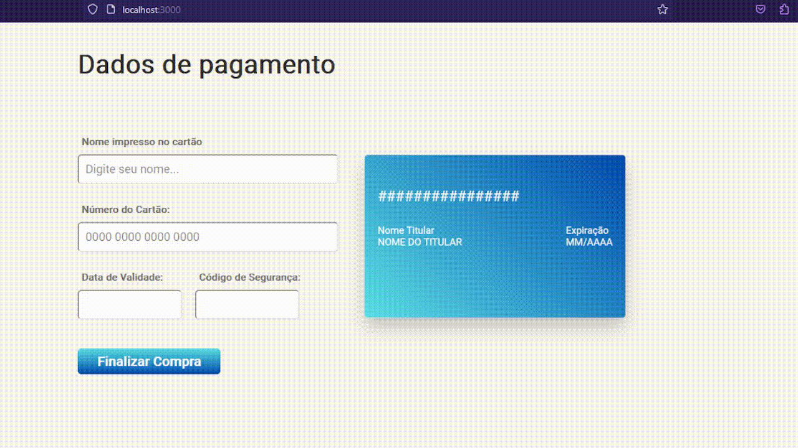

## Card Validation Project

Este é um projeto que simula um formulário de pagamento com validação de dados de cartão de crédito. O usuário pode preencher o formulário com o nome do titular do cartão, número do cartão, data de validade e código de segurança. O projeto também possui uma representação visual do cartão de crédito ao lado do formulário.

### Preview do Projeto

### Funcionalidades

- Validação do nome do titular do cartão: O campo do nome do titular do cartão é obrigatório. Caso esteja vazio, uma mensagem de erro será exibida.
- Validação do número do cartão de crédito: O campo do número do cartão deve conter 16 dígitos válidos. Caso esteja vazio ou contenha caracteres inválidos, uma mensagem de erro será exibida.
- Máscara do número do cartão: O número do cartão será mascarado e exibido no formato "#### #### #### ####".
- Validação da data de validade: O campo da data de validade deve conter um valor no formato "MM/AAAA". A data de validade não pode ser anterior à data atual. Caso o formato seja inválido ou a data seja inválida, uma mensagem de erro será exibida.
- Validação do código de segurança: O campo do código de segurança deve conter 3 dígitos válidos. Caso esteja vazio ou contenha caracteres inválidos, uma mensagem de erro será exibida.
- Representação visual do cartão de crédito: Conforme o usuário preenche o formulário, o cartão de crédito é atualizado com as informações inseridas.
- Confirmação de pagamento: Após a validação do formulário, o usuário pode finalizar a compra e será redirecionado para a página de confirmação de pagamento.

### Como executar o projeto

1. Clone o repositório para sua máquina local.
2. Utilize o comando `npm run start`, ele abrirá o arquivo `index.html` em seu navegador na porta `3000`, assim você irá visualizar o formulário de pagamento.
3. Preencha os campos do formulário e clique no botão "Finalizar Compra".
4. Caso ocorra algum erro de validação, as mensagens de erro serão exibidas e o formulário não será enviado.
5. Caso os campos estejam preenchidos corretamente, você será redirecionado para a página de confirmação de pagamento.

### Dependências do projeto

- [@babel/core](https://www.npmjs.com/package/@babel/core)
- [@babel/plugin-transform-modules-commonjs](https://www.npmjs.com/package/@babel/plugin-transform-modules-commonjs)
- [babel-jest](https://www.npmjs.com/package/babel-jest)
- [eslint](https://www.npmjs.com/package/eslint)
- [gh-pages](https://www.npmjs.com/package/gh-pages)
- [htmlhint](https://www.npmjs.com/package/htmlhint)
- [jest](https://www.npmjs.com/package/jest)
- [opener](https://www.npmjs.com/package/opener)
- [serve](https://www.npmjs.com/package/serve)

### Scripts

- `htmlhint`: Executa a verificação de erros no HTML dos arquivos `src/*.html` e `test/*.html`.
- `eslint`: Executa a verificação de erros no código JavaScript dos arquivos `src/` e `test/`.
- `pretest`: Executa a verificação de erros no HTML e no código JavaScript antes de executar os testes.
- `test`: Executa os testes do projeto usando o Jest e exibe um relatório de cobertura.
- `open-coverage-report`: Abre o relatório de cobertura gerado pelo Jest.
- `start`: Inicia um servidor para visualização do formulário de pagamento (`index.html`).
- `deploy`: Faz o deploy do projeto para a branch gh-pages.

---
